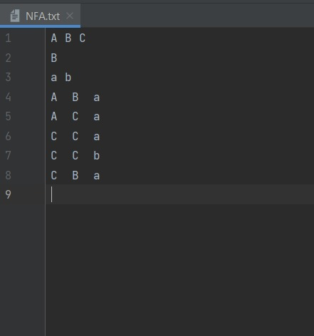
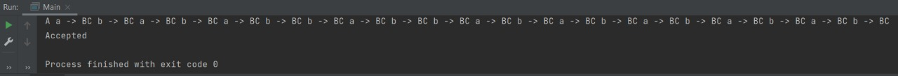
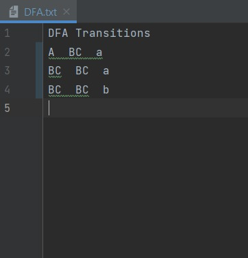

# NFA to DFA Converter
## A Java Based Converter for NFA-DFA

[](https://github.com/AsjadIftikhar/PandaCompiler.git)

NFA-DFA Converter is a Java based program for converting an NFA-null to a DFA


## Features

- INPUT: NFA null in input file called NFA.txt
- Converts NFA null to simple NFA
- Converts NFA to DFA
- Remove unreachable states
- Minimize states
- Execute an input string on DFA
- Object-Oriented Approach
- Output: DFA.txt with DFA transitions

## sample Screenshots
- Input



- Output of the program looks like this:



- Output File:



## Installation

Step 1.

```sh
Initialize an empty Java Project in any IDE like Intellij IDEA or NetBeans
```

Step 2.

```sh
Replace src folder
```

Step 3.

```sh
Place the source NFA file with correct format in the same folder as src
```

Step 4.

```sh
In Main.java change Pararmeters as required:
- fileName
- input_string_for_dfa

Execute main
```

Good Luck! Have a nice day.

